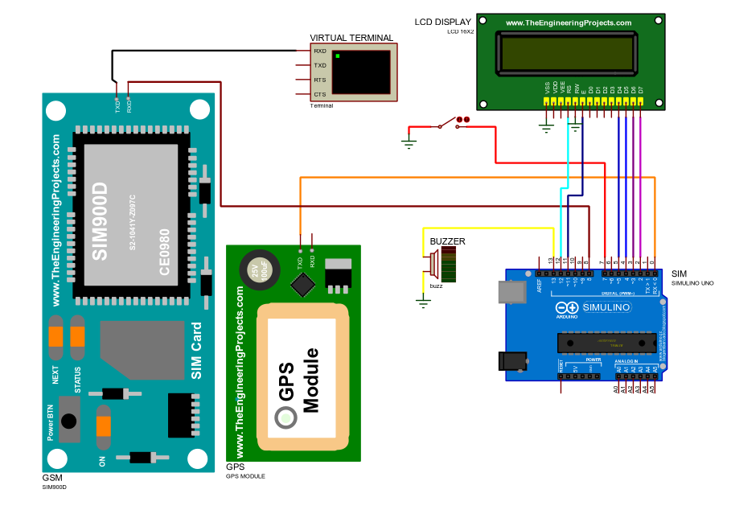
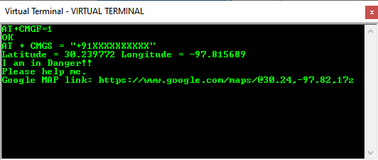

# IOT-women-safety-device

This is a miniproject in IOT that helps to ensure the safety of women in case of any emergencies.

Hardware Requirements: 
1.Arduino UNO 
2.GPS module 
3.GSM module 
4.Buzzer 
5.LCD Display 
6.Switch/Button

Software Requirements: 
1.Proteus Software (For Simulation) 
https://www.labcenter.com/ 

2.Arduino Program Editor 
https://create.arduino.cc/editor

Results:

